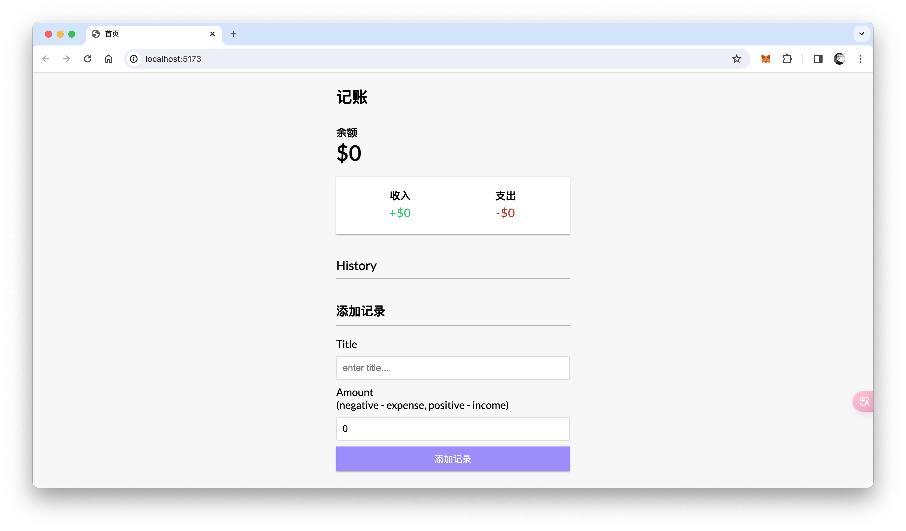
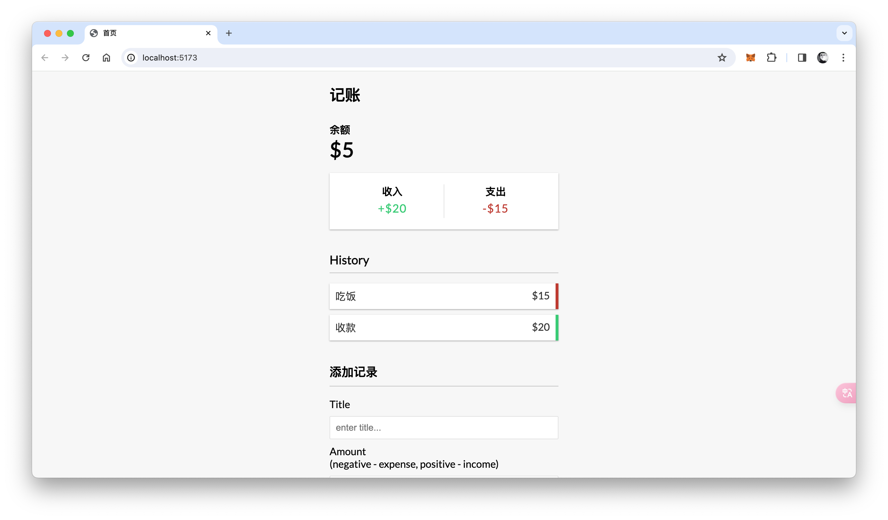

# GracefulGains - 基于 T1 后端云开发的记账工具

## 项目介绍

本项目中使用了 T1 后端云（www.t1y.net）聚合查询、高级查询、添加、删除数据 RESTful API 接口，使用前端 Vue.js 框架开发，实现了记账工具的基本功能。

## 项目截图




## 使用

### 安装依赖

```shell
npm install
```

### 启动项目

```shell
npm run dev
```

### 配置

修改项目根目录中的 `.env` 配置文件中的内容为您 T1 后端云应用密钥信息即可。

```env
# 您的 App ID
VITE_APP_APP_ID = '1001'
# 您的 API Key
VITE_APP_API_KEY = '2c6118c4e02b40fe96f5c40ee1dc5561'
# 您的 Secret Key
VITE_APP_SECRET_KEY = '650bd657da0243b282d9cab6d75a80ff'
# 您已备案域名
VITE_APP_T1Y_API = 'https://api.t1y.net'
# 记账数据存储的表
VITE_APP_HISTORY_TABLE = 'history'
```
